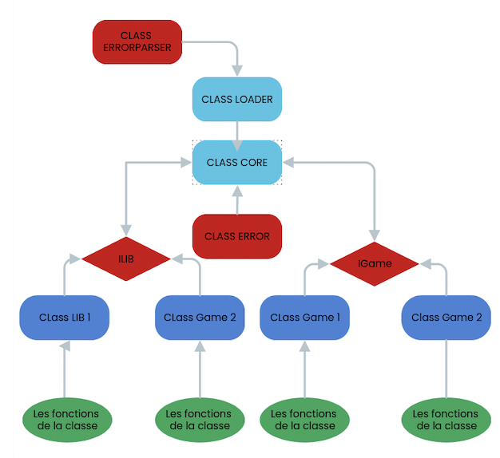

# Documentation Arcade

Cette documentation vous servira à comprendre le fonctionnement de l'arcade et
comment intégrer votre jeu ou librairie graphique.

# Table des matières

- [INTERFACE](#Interfaces)
    - [Interface Graphique : ILib](#Datastructure)
        - [Data structure](#Data-structure)
        - [Méthodes](#Méthodes)

    - [Interface Jeu : IGame](#IGAME)
        - [Méthodes](#Méthodes)

- [LIBRAIRIE GRAPHIQUE](#Librairie-Graphique)
    - [SFML](#SFML)
        - [Creation d'une librairie graphique](#Creation-d'une-librairie-graphique)
        - [Affichage](#Affichage)
        - [Gestion des évènements](#Gestion-des-évènements)

# Core

Le core dans l'arcade est le coeur du programme. Il est chargé de gérer les
librairies graphiques et les jeux. Il fait appel aux librairies graphiques et
aux jeux pour afficher les jeux.
Elle fait appel aussi un classe `Error` qui gère les erreurs.

Le core est la classe `Arcade` qui se trouve dans un fichier `Arcade.hpp`.
Afin de récuprer les librairies graphiques et les jeux, il fait appel à la
classe `Loader` qui se trouve dans un fichier `Loader.hpp`.

## Diagramme explicatif



## Loader

La classe `Loader` permet de charger les librairies graphiques et les jeux.

### Variables

Un template `T` qui est soit un jeu ou une librairie graphique.

- T *_lib : Librairie graphique chargée

### Méthodes

- Loader() : Constructeur de la classe `Loader`

- ~Loader() : Destructeur de la classe `Loader`

- void LoadLib(std::string &libname, std::string const &point) : Charge une librairie graphique

    -> libname : nom de la librairie graphique

    -> point : le point d'entrée de la librairie graphique

- T *getLib() : Retourne la librairie graphique chargée

- class ErrorParser : Gère les erreurs de la classe `Loader`

## Fonctionnement du Core

### Variables Importantes

- Loader(ILib) _lib : Charge la librairie graphique
- Loader(IGame) _game : Charge le jeu


### Méthodes

- Arcade(std::string) : Constructeur de la classe `Arcade`
    -> libname : nom de la librairie graphique à charger

- ~Arcade() : Destructeur de la classe `Arcade`

- void getGameLib() : Stocke les noms des librairies jeux dans un std::vector<std::string>

- void getGraphicLib() : Stocke les noms des librairies graphiques dans un std::vector<std::string>

- void LoadnextLib() : Charge la librairie graphique suivante

- void LoadnextGame() : Charge la librairie jeu suivante

- void loop() : Boucle principale du programme où le core va intéragir avec les librairies graphiques et les jeux 

    *Par exemple, si l'utilisateur appuie sur la touche `LEFT`, le core va appeler la méthode `handleEvent` de la librairie graphique et qui va renvoyer la touche `LEFT` à la méthode rungame du jeu qui va faire bouger le personnage à gauche.*


# Interfaces

Nous avons défini des interfaces pour les jeux et les librairies graphiques.

## Interface Graphique : ILib

Pour pouvoir implémenter une librairie graphique, il faut hériter de l'interface
`ILib`.

Chaque classe héritant de cette interface doit implémenter un extern "C" qui
renvoie un pointeur vers la classe afin de pouvoir récupérer la classe dans le
core.

```
extern "C" ILib *entryLib()
{
    return new *Nom de la classe*();
}
```


L'interface graphique est définie dans le fichier `ILib.hpp`. Elle contient
les méthodes suivantes :

```
#ifndef ILIB_HPP_
    #define ILIB_HPP_

    #include <array>
    #include <iostream>
    #include <vector>
    #include <string>
    #include <unordered_map>

struct Vector2i {
    int x;
    int y;
};

struct rgba {
    u_int8_t r;
    u_int8_t g;
    u_int8_t b;
    u_int8_t a;
};

#ifndef KEY_HPP_
    #define KEY_HPP_
    enum Key {
        LEFT,
        RIGHT,
        UP,
        DOWN,
        QUIT, // quitte le jeu
        PAUSE, // pause
        LIB, // change de lib
        GAME, // change de jeux
        VALID,
        RESET
    };
#endif /* !KEY_HPP_ */

class ILib {
    public:
        virtual ~ILib() = default;
        virtual int handleEvent() = 0;
        virtual void drawText(const std::string text, const Vector2i pos, const size_t size) = 0;
        virtual void drawRect(const Vector2i pos, const Vector2i size, const rgba color) = 0;
        virtual void displayMap(const std::vector<std::string> map, int score, std::unordered_map<char, std::array<u_int8_t, 4>> rbg) = 0;
        virtual void menu() = 0;
    protected:
    private:
};

#endif /* !ILIB_HPP_ */
```

### Data structure

- structure Vector2i : Structure contenant les coordonnées d'un point (x, y)

- structure rgba : Structure contenant les composantes d'une couleur (r, g, b, a)

- enum Key : Enumération contenant les touches du clavier

    -> LEFT : aller à gauche

    -> RIGHT : aller à droite

    -> UP : aller en haut

    -> DOWN : aller en bas

    -> QUIT : quitter le jeu

    -> PAUSE : mettre en pause

    -> LIB : changer de librairie graphique

    -> GAME : changer de jeu

    -> VALID : valider

    -> RESET : recommencer le jeu

### Méthodes

- virtual ~ILib() : Destructeur virtuel

- virtual int handleEvent() = 0 : Gère les évènements clavier et souris
    -> ne prend rien en paramètre

- virtual void drawText(const std::string text, const Vector2i pos, const size_t size) = 0 : Dessine du texte

    -> text : texte à afficher

    -> pos : position du texte (x, y)

    -> size : taille du texte

- virtual void drawRect(const Vector2i pos, const Vector2i size, const rgba color) = 0 : Dessine un rectangle

    -> pos : position du rectangle (Vector2i : x, y)

    -> size : taille du rectangle (x, y)

    -> color : couleur du rectangle (rgba : r, g, b, a)

- virtual void displayMap(const std::vector<std::string> map) = 0 : Affiche la map du jeu
    -> map : map à afficher (std::vector<std::string>)

- virtual void menu() = 0; : Affiche le menu du jeu
    -> ne prend rien en paramètre

### Utilisation d'asset

Pour utiliser des assets, il faut les stocker dans le dossier `assets/` du
projet. Pour les utiliser, il faut les charger dans la librairie graphique.

## Interface Jeu : IGame

Pour pouvoir implemnter un jeu, il faut passer par l'interface `IGame`.

Chaque classe héritant de cette interface doit implémenter un extern "C" qui
renvoie un pointeur vers la classe afin de pouvoir récupérer la classe dans le
core.

```
extern "C" IGame *entryGame()
{
    return new *Nom de la classe*();
}
```

L'interface jeu est définie dans le fichier `IGame.hpp`. Elle contient les
méthodes suivantes :

```
#ifndef IGAME_HPP_
    #define IGAME_HPP_

#include <iostream>
#include <vector>
#include <string>
#include <unordered_map>
#include <array>

#ifndef KEY_HPP_
    #define KEY_HPP_
        enum Key {
            LEFT,
            RIGHT,
            UP,
            DOWN,
            QUIT, // quitte le jeu
            PAUSE, // pause
            LIB, // change de lib
            GAME, // change de jeux
            VALID,
            RESET
        };
#endif /* !KEY_HPP_ */

class IGame {
    public:
        virtual ~IGame() = default;
        virtual std::vector<std::string> getMap() const = 0;
        virtual void runGame(std::size_t key) = 0;
        virtual bool getStatus() const = 0;
        virtual void restart() = 0;
        virtual std::size_t getScore() const = 0;
        virtual std::unordered_map<char, std::array<u_int8_t, 4>> getRgbValues() const = 0;
};

#endif /* !IGAME_HPP_ */
```

### Méthodes

- virtual ~IGame() : Destructeur virtuel

- virtual std::vector<std::string> getMap() const = 0 : Récupère la map du jeu

    -> ne prend rien en paramètre

- virtual void runGame(std::size_t key) = 0 : Gère les jeu en fonction de la touche appuyée

    -> key : touche appuyée

- virtual bool getStatus() const = 0 : Récupère le status du jeu

- virtual void restart() = 0 : recommence le jeu

- virtual std::size_t getScore() const = 0 : Récupère le score du jeu

- virtual std::unordered_map<char, std::array<u_int8_t, 4>> getRgbValues() const = 0 : recupere les couleurs des objets du jeu

# Librairies graphiques

## Compilation

Pour génerer une librairie graphique, il faut la compiler avec la commande suivante :

- d'abord la nommer avec le suffixe .so
- Et compiler tous les fichiers en générant une librairie dynamique


## Class SFML

La librairie graphique SFML est définie dans le fichier `SFML.hpp`. Elle est héritée de l'interface `ILib`.

### Création de la librairie


```
Entry point : EntryLib

extern "C" ILib *EntryLib()
{
    return new SFML();
}

SFML::SFML() 

    -> Constructeur de la classe SFML


SFML::~SFML()
    
    -> Destructeur de la classe SFML

```

### AFFICHAGE

```
void SFML::drawText(const std::string text, const Vector2i pos, const size_t size) 

    -> prend en paramètre :
        -> text : texte à afficher
        -> pos : position du texte (x, y)
        -> size : taille du texte

    -> permet d'afficher du texte

void SFML::drawRect(const Vector2i pos, const Vector2i size, const rgba color)

    -> prend en paramètre :
        -> pos : position du rectangle (Vector2i : x, y)
        -> size : taille du rectangle (x, y)
        -> color : couleur du rectangle (rgba : r, g, b, a)

    -> permet de dessiner un rectangle et de le remplir avec une couleur précisée

void SFML::displayMap(const std::vector<std::string> map, int score, std::unordered_map<char, std::array<u_int8_t, 4>> rbg)

    -> prend en paramètre :
        -> map : map à afficher (std::vector<std::string>)
        -> score : score du jeu
        -> rbg : couleur des objets du jeu

    -> permet d'afficher la map du jeu

void SFML::menu()
    
        -> ne prend rien en paramètre
        -> permet d'afficher le menu du Arcade
```

### GESTION DES EVENEMENTS

```
int SFML::handleEvent()
    
        -> ne prend rien en paramètre
        -> permet de gérer les évènements clavier et souris
        -> retourne la touche appuyée
```

## Class NCURSES

La librairie graphique NCURSES est définie dans le fichier `NCURSES.hpp`. Elle est héritée de l'interface `ILib`.

### Création de la librairie

```
Entry point : EntryLib

extern "C" ILib *EntryLib()
{
    return new NCURSES();
}

NCURSES::NCURSES() 

    -> Constructor
    
NCURSES::~NCURSES()
        
    -> Destructor
```

### AFFICHAGE

```
void NCURSES::drawText(const std::string text, const Vector2i pos, const size_t size) 

    -> prend en paramètre :
        -> text : texte à afficher
        -> pos : position du texte (x, y)
        -> size : taille du texte

    -> permet d'afficher du texte

void NCURSES::drawRect(const Vector2i pos, const Vector2i size, const rgba color)

    -> prend en paramètre :
        -> pos : position du rectangle (Vector2i : x, y)
        -> size : taille du rectangle (x, y)
        -> color : couleur du rectangle (rgba : r, g, b, a)

    -> permet de dessiner un rectangle et de le remplir avec une couleur précisée

void NCURSES::displayMap(const std::vector<std::string> map, int score, std::unordered_map<char, std::array<u_int8_t, 4>> rbg)

    -> prend en paramètre :
        -> map : map à afficher (std::vector<std::string>)
        -> score : score du jeu
        -> rbg : couleur des objets du jeu

    -> permet d'afficher la map du jeu

void NCURSES::menu()
    
        -> ne prend rien en paramètre
        -> permet d'afficher le menu en ncurses

```

### GESTION DES EVENEMENTS

```

int NCURSES::handleEvent()
    
        -> ne prend rien en paramètre
        -> permet de gérer les évènements clavier et souris
        -> retourne la touche appuyée
```

# Librairies de jeux

## Compilation

Pour génerer une librairie de jeu, il faut la compiler avec la commande suivante :

- d'abord la nommer avec le suffixe .so
- Et compiler tous les fichiers en générant une librairie dynamique


## Class Pacman

Le jeu Pacman est défini dans le fichier `Pacman.hpp`. Il est hérité de l'interface `IGame`.

### Création du jeu

```
Entry point : EntryGame

extern "C" IGame *EntryGame()
{
    return new Pacman();
}

Pacman::Pacman() 

    -> Constructeur de la classe Pacman

Pacman::~Pacman()

    -> Destructeur de la classe Pacman
```

### Variables importantes

```
std::vector<std::string> _map
    -> stocker la map du jeu

std::size_t _score
    -> stocker le score du jeu

std::unordered_map<char, std::array<u_int8_t, 4>> _rgbValues
    -> stocker les couleurs des objets du jeu (pacman, fantome, mur, ...)     

```

### Méthodes

```
std::vector<std::string> Pacman::getMap() const
    -> retourne la map du jeu

void Pacman::runGame(std::size_t key)
        -> prend en paramètre :
            -> key : touche appuyée
        -> permet de gérer le jeu en fonction de la touche appuyée

bool Pacman::getStatus() const
        -> retourne le status du jeu

void Pacman::restart()
        -> permet de recommencer le jeu

std::size_t Pacman::getScore() const
         -> retourne le score du jeu

std::unordered_map<char, std::array<u_int8_t, 4>> Pacman::getRgbValues() const
        -> retourne les couleurs des objets du jeu
```

## Class Snake

Le jeu Snake est défini dans le fichier `Snake.hpp`. Il est hérité de l'interface `IGame`.

### Création du jeu

```
Entry point : EntryGame

extern "C" IGame *EntryGame()
{
    return new Snake();
}

Snake::Snake() 

    -> Constructeur de la classe Snake

Snake::~Snake()

    -> Destructeur de la classe Snake
```

### Variables importantes

```

std::vector<std::string> _map
    -> stocker la map du jeu

std::size_t _score
    -> stocker le score du jeu

std::unordered_map<char, std::array<u_int8_t, 4>> _rgbValues
    -> stocker les couleurs des objets du jeu (snake, mur, ...)     

```

### Méthodes

```
std::vector<std::string> Snake::getMap() const
    -> retourne la map du jeu

void Snake::runGame(std::size_t key)
    -> prend en paramètre :
        -> key : touche appuyée
    -> permet de gérer le jeu en fonction de la touche appuyée

bool Snake::getStatus() const
    -> retourne le status du jeu

void Snake::restart()
    -> permet de recommencer le jeu

std::size_t Snake::getScore() const
    -> retourne le score du jeu

std::unordered_map<char, std::array<u_int8_t, 4>> Snake::getRgbValues() const
    -> retourne les couleurs des objets du jeu
```
